Zion Mincey
AWS-AD-Domain-controller-lab
Cloud hosted Active Directory lab: AWS EC2, Windows Server, user/group management, and ticketing workflow."
# Cloud-Hosted Active Directory Lab

# Objective
Set up a Windows Server domain controller on AWS, manage users and
groups in Active Directory, and track the work with a ticketing
system like a real IT helpdesk workflow.

# Architecture
AWS EC2 (Windows Server 2022) → promoted to Domain Controller
(AD DS + DNS, domain: `homelab.local`) → users and groups managed in
Active Directory Users and Computers → changes tracked and resolved
as tickets in Jira Service Management

# 1. Provisioned the cloud infrastructure
Launched a `t3.micro` Windows Server 2022 EC2 instance and confirmed
it passed all status checks.
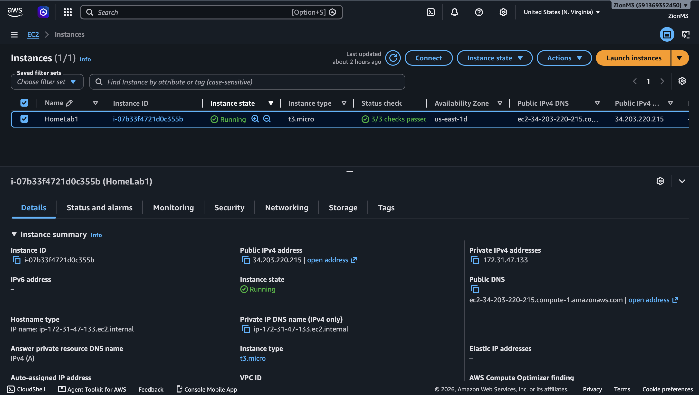
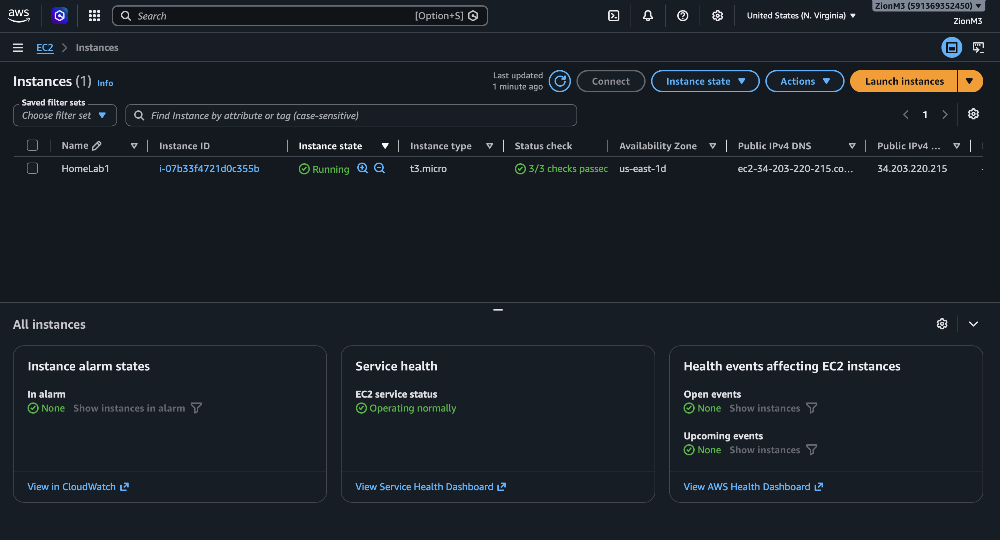

Locked down remote access to RDP (port 3389) from my IP only —
not open to the internet.
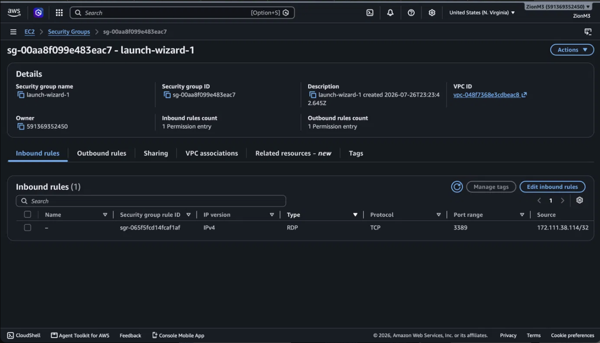

# 2. Configured the base server
Logged in for the first time and confirmed the instance identity,
then verified Windows Firewall was active before making any changes.
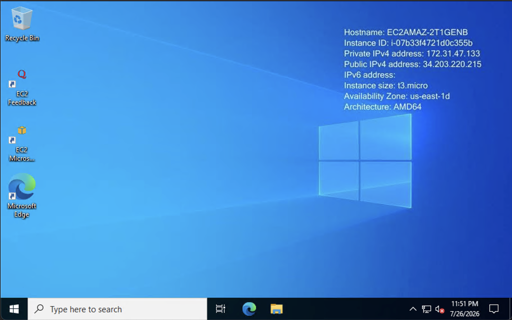
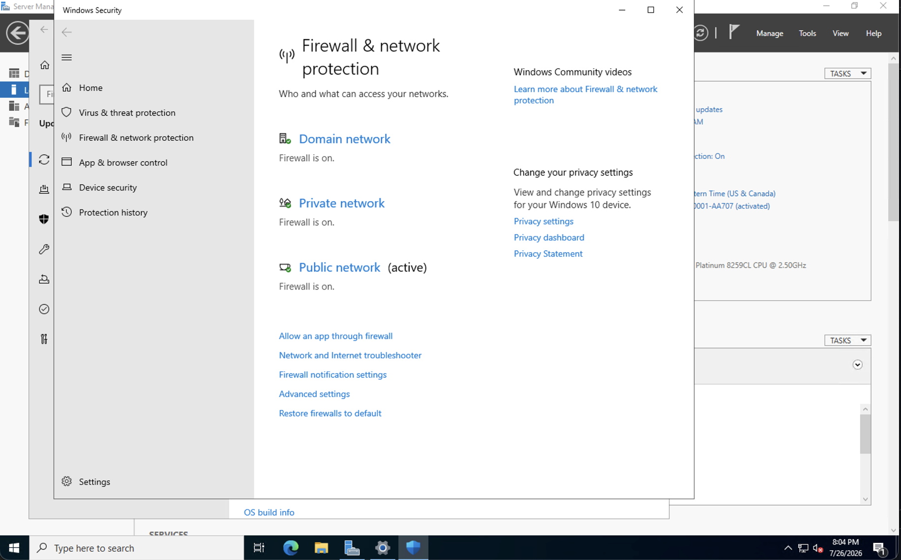

# 3. Promoted the server to a Domain Controller
Before promotion, the server was a standalone workgroup machine:
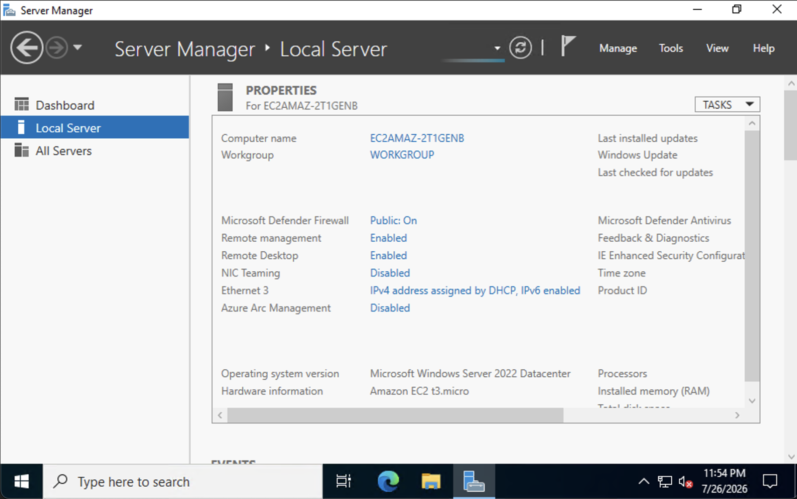

Installed the AD DS and DNS Server roles:
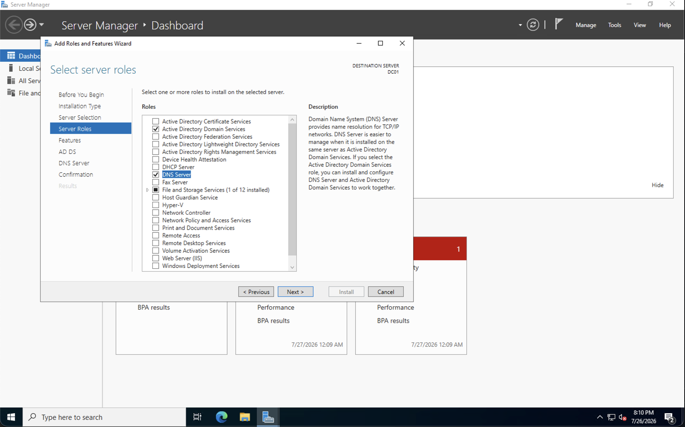

After promotion, the server was renamed `DC01` and now belongs to the
`homelab.local` domain instead of a workgroup:
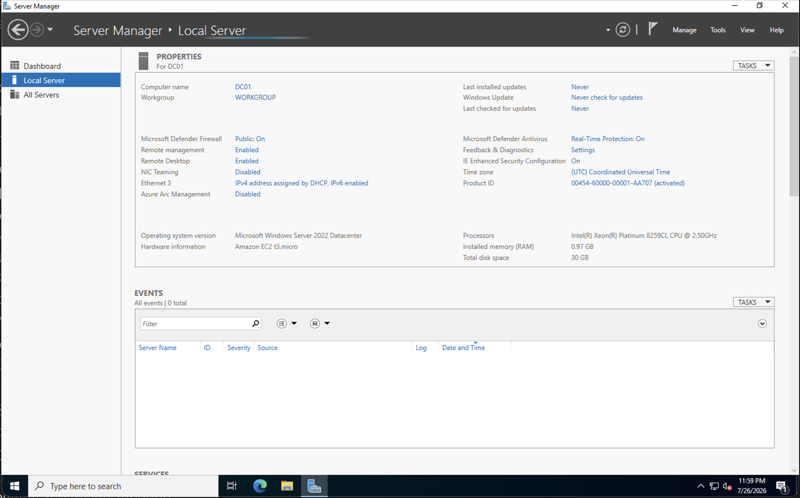
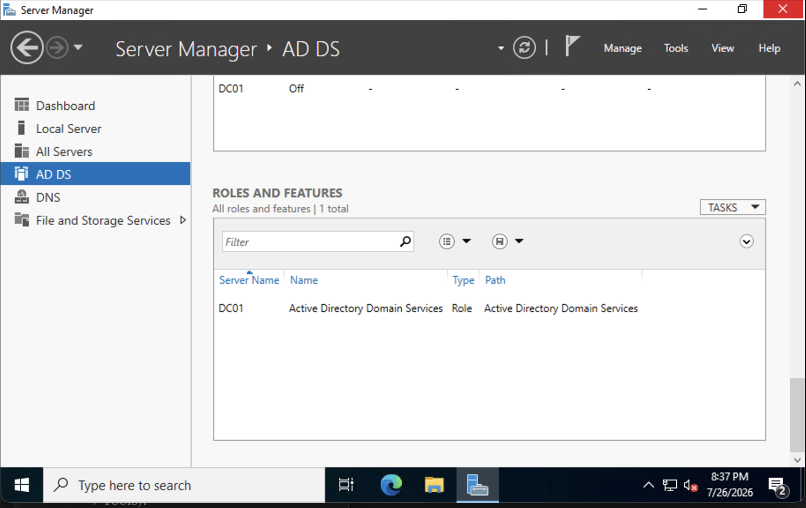

# 4. Managed users and groups in Active Directory
Created a new user account for a simulated new hire:
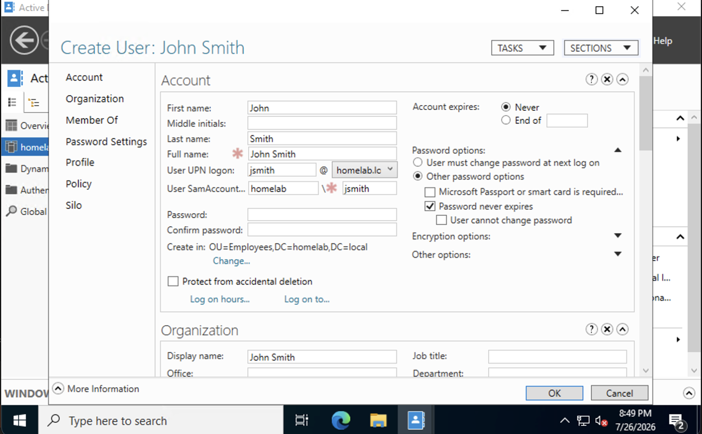

Created a security group for the Sales department:
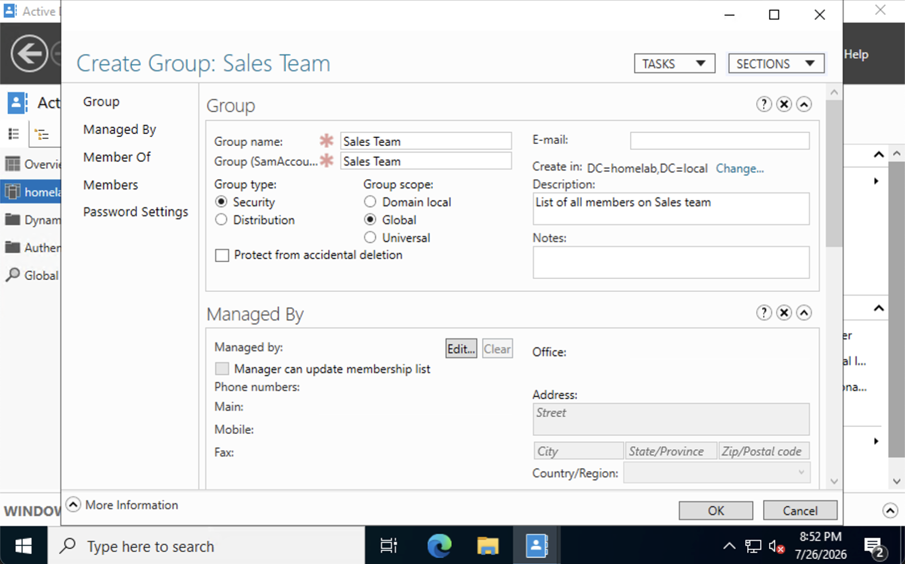
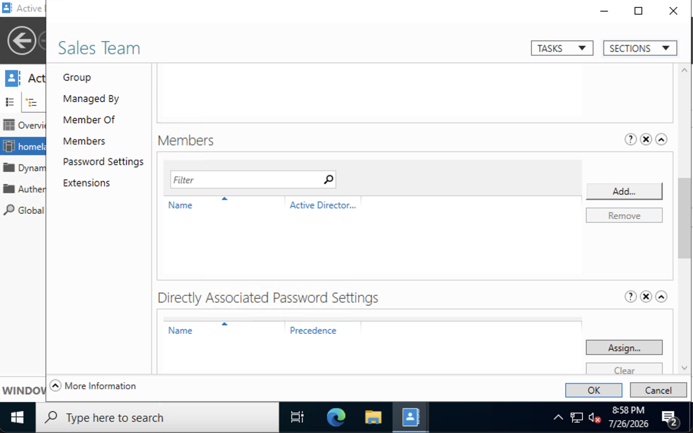

Added the new user to the group, completing the onboarding task:
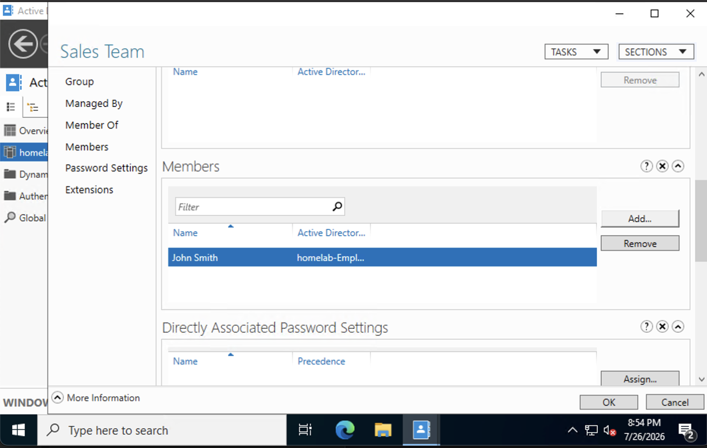

# 5. Tracked the work through a ticketing workflow
Set up an IT Service Management project in Jira and logged each AD
change as a real support request before working it — mirroring how a
helpdesk actually operates.
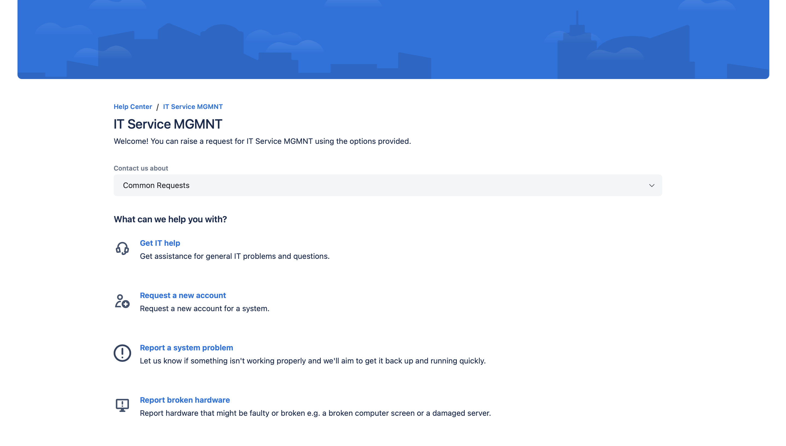
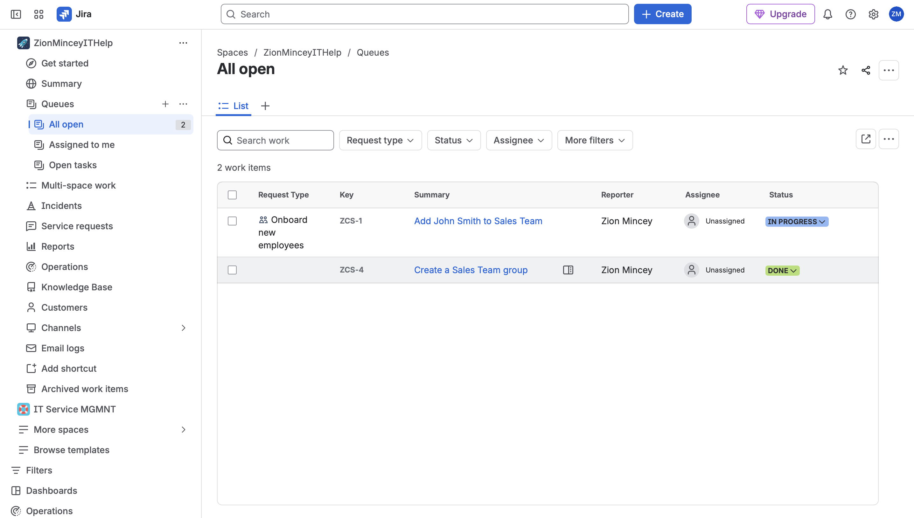

# Skills demonstrated
- AWS EC2 provisioning, security groups, least privilege network access
- Windows Server 2022 administration
- Active Directory Domain Services deployment
- User and group lifecycle management (onboarding workflow)
- IT service management / ticketing workflow (Jira Service Management)

# Lessons learned
In a real environment, I'd add group policies for password rules,
organize users by department instead of one flat list, and track
every AD change with a ticket for accountability.
